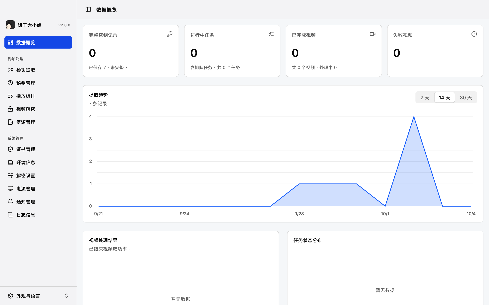

<div align="center">
  
  <h1>Binggan</h1>
  <p><strong>饼干大小姐</strong></p>
  <p>密钥提取 · 播放编排 · 视频解密 · 资源管理</p>
  <p>
    <a href="https://github.com/hackerlengyue/binggan/actions/workflows/ci.yml"></a>
    
    
    
    
  </p>
  <p><strong>简体中文</strong> · <a href="docs/README.en.md">English</a></p>
  <p><a href="#预览">预览</a> · <a href="#功能">功能</a> · <a href="#快速开始">快速开始</a> · <a href="#开发文档">开发文档</a> · <a href="#致谢">致谢</a></p>
</div>

---

Binggan 是一款本地视频处理工具。你可以在同一工作区提取和管理密钥、安排课程播放、批量解密 `.sz` 视频，再浏览或播放导出的 MP4。采集记录、任务和设置保存在本地，界面支持简体中文、英文及深浅色主题。

## 预览



**[观看介绍视频](docs/media/binggan-desktop-overview.mp4)** · 约 1 分 18 秒 · 1920 × 1080

## 功能

| 工作区 | 能做什么 |
| --- | --- |
| 密钥提取 | 启停本地采集、查看请求、保存密钥记录。 |
| 密钥管理 | 命名、搜索、复制、导出和删除已保存记录。 |
| 播放编排 | 为选中的 Sz课程建立队列，跟踪播放、采集与记录保存。 |
| 视频解密 | 导入本地 `.sz` 文件和对应密钥 JSON，执行批量任务并导出 MP4。 |
| 资源管理 | 浏览成片、查看缩略图、内置播放和跳转进度。 |
| 软件设置 | 管理证书、解密参数、通知、电源设置，检查运行环境。 |
| 界面 | 支持简体中文和英文，以及浅色和深色主题。 |

### 平台支持

| 平台 | 当前范围 |
| --- | --- |
| macOS | 支持开发与打包；播放编排使用原生辅助功能驱动。 |
| Windows | 运行未进行测试。提供 x64 与 ARM64 自动构建；原生播放编排驱动尚未实现。 |
| Linux | 尚未提供平台资源准备与打包配置。 |

macOS 的系统授权、真实播放器完整队列、长时间防息屏、锁屏行为和打包应用通知仍需人工验证。

采集和解密功能用于处理本人拥有或已获授权的内容。

## 快速开始

### 环境要求

以下要求适用于从源码开发：

| 工具 | 版本与用途 |
| --- | --- |
| Go | `1.27.1+`，版本下限见 [go.mod](go.mod)，用于编译 MyGo 后端。 |
| Node.js | `22.12.0+`，版本下限见 [package.json](package.json)，使用随附的 npm 安装依赖并运行前端与开发脚本。 |
| macOS 编译工具 | Xcode Command Line Tools，提供原生编译所需的 Clang 和系统 SDK。 |

MyGo CLI `0.2.5` 随 `npm ci` 安装。FFmpeg 和 ffprobe 由资源准备命令按平台下载，无需提前全局安装。

**打包 macOS 应用：** 还需 Swift `6.2+` 和兼容 SDK，具体步骤见 [macOS 打包说明](docs/development/README.md#macos)。

**运行已打包的应用：** 无需安装上述开发工具。macOS 最低部署版本在 [应用配置](mygo.config.ts) 中设为 `13.0`。

**Windows：** 运行环境需 WebView2；运行未进行测试，构建命令见 [开发指南](docs/development/README.md#windows未进行测试)。

### 安装与启动

在项目根目录执行。以下以 Apple Silicon Mac 为例：

```sh
npm ci
npm run setup
npm run prepare:resources -- --platform darwin-arm64
npm run dev
```

`npm run setup` 会安装前端依赖、下载 Go module 并生成前端绑定。资源目标按当前机器选择：

| 机器 | 资源目标 |
| --- | --- |
| Apple Silicon Mac | `darwin-arm64` |
| Intel Mac | `darwin-amd64` |
| Windows x64（未进行测试） | `windows-amd64` |
| Windows ARM64（未进行测试） | `windows-arm64` |

平台工具根据来源清单下载并校验 SHA-256。

### 开发工作区

开发数据默认位于 `.local/user-data/`，新目录从空白状态开始。开发入口使用独立端口和 WebView 身份，与已安装应用分开。

重新开始时，先退出开发应用，再把该目录移到备份位置，随后运行 `npm run dev`。自定义路径见 [数据目录](docs/development/README.md#数据目录)。

## 开发文档

后端使用 MyGo，前端使用 Vue、shadcn-vue 和 Tailwind。业务调用通过生成绑定，实时采集使用 Channel，媒体使用自定义 Protocol；SQLite 保存设置与任务记录。

完整目录见 [文档导航](docs/README.md)。

| 文档 | 内容 |
| --- | --- |
| [开发与打包](docs/development/README.md) | 日常命令、数据目录、平台工具、测试与应用打包。 |
| [前端开发](docs/development/frontend.md) | 界面工程、组件来源与设计约定。 |
| [贡献指南](docs/CONTRIBUTING.md) | 问题报告、提交说明和验证方式。 |
| [安全与隐私](docs/SECURITY.md) | 分享日志及报告安全问题时的注意事项。 |

准备好对应平台资源后，可执行完整检查：

```sh
npm run check
```

推送 `main` 或提交 PR 后，GitHub Actions 会运行检查，并构建 macOS、Windows（运行未进行测试）的 ARM64 与 x64 产物。压缩包及 SHA-256 校验文件可在 [构建记录](https://github.com/hackerlengyue/binggan/actions/workflows/ci.yml) 中下载，保留 14 天。版本标签会触发 [Release](https://github.com/hackerlengyue/binggan/releases) 发布，操作见 [自动构建与发布](docs/development/README.md#自动构建与发布)。

<details>
<summary>查看项目目录</summary>

```text
binggan/
├── README.md                    项目说明
├── cmd/capture-service/         采集辅助程序
├── internal/                    Go 业务、存储、处理与测试
├── frontend/                    Vue 界面与生成的 MyGo 客户端
├── native/permission-helper/    macOS 授权辅助程序源码
├── resources/                   应用图标、来源清单与许可证
├── scripts/                     开发、打包与仓库检查
├── docs/                        文档导航、英文 README 与协作说明
│   ├── development/             开发、打包与前端约定
│   ├── third-party/             第三方许可与资源来源
│   ├── assets/                  界面图片
│   └── media/                   介绍视频
└── .github/                     CI 与 Issue 模板
```

</details>

## 许可

项目主许可证尚未确定。第三方依赖各自的许可证、资源来源及 Logo、视频的许可状态见 [第三方许可与资源](docs/third-party/README.md)。其中包含 GPL-3.0 组件，现有许可文件已保留。

## 致谢

感谢以下开源项目的作者与贡献者：

| 项目 | 在 Binggan 中的用途 | 链接 |
| --- | --- | --- |
| **MyGo** | 桌面窗口、Go 与前端绑定、事件通信和应用打包。 | [GitHub](https://github.com/egoist/mygo) |
| **shadcn-vue** | Vue 界面组件与布局参考。 | [官网](https://shadcn-vue.com/) · [GitHub](https://github.com/unovue/shadcn-vue) |
| **Apple TV Like Player** | 资源管理中的内置视频播放器。 | [GitHub](https://github.com/doraFX/apple-tv-like-player) |
| **LXGW WenKai** | 启动画面的字体（霞鹜文楷）。 | [GitHub](https://github.com/lxgw/LxgwWenKai) |
| **PermissionFlow** | macOS 权限设置引导与授权辅助窗口。 | [GitHub](https://github.com/jaywcjlove/PermissionFlow) |
| **sing-box** | TUN 隧道与采集流量路由。 | [GitHub](https://github.com/SagerNet/sing-box) |
